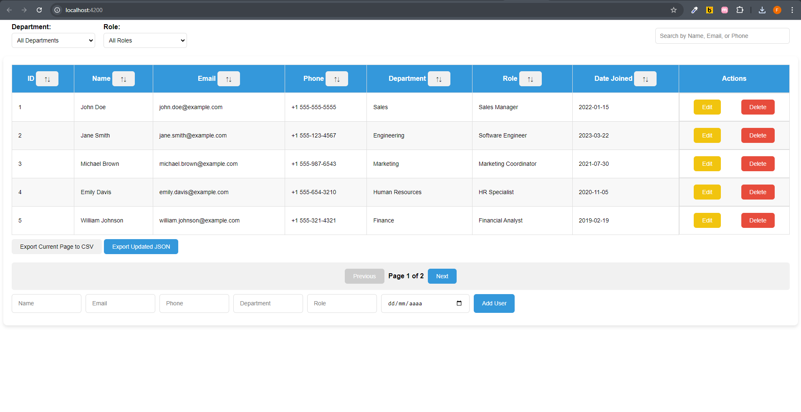
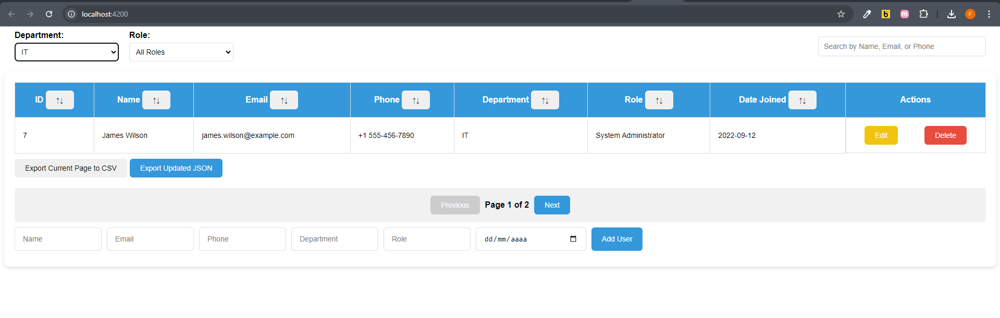
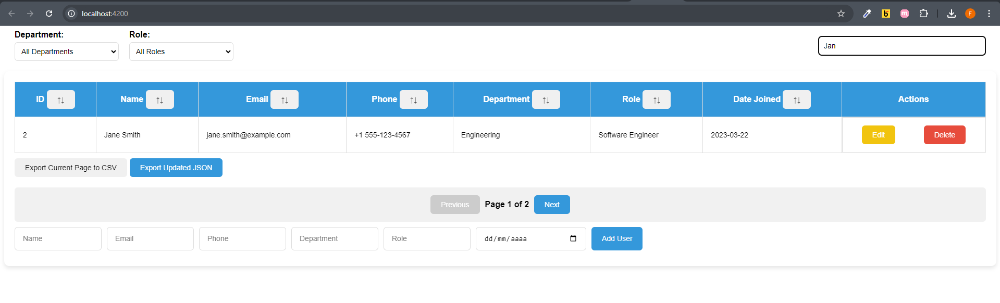
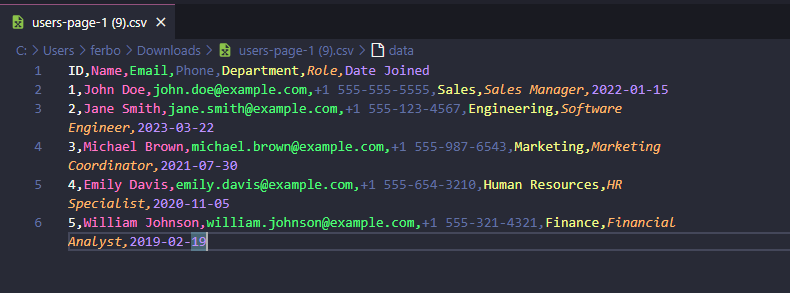

# Processo Seletivo Front-End Angular - Vai na Web

Este projeto é uma aplicação web de gerenciamento de usuários desenvolvida com Angular. Ele permite que os usuários adicionem, editem, excluam e filtrem dados de usuários, além de exportar os dados para arquivos CSV e JSON.


## Como utilizar a aplicação
Ao entrar no aplicativo, você consegue ver a lista de usuários existentes, ao paginar, ele carrega mais dados dos próximos usuários.



## Filtro
Ao digitar o nome, e-mail ou telefone do usuário desejado, a lista atualiza com os usuários que derem match com sua pesquisa.



Ao selecionar o departamento, você recebe a lista de usuários do tipo selecionado.



## Exportação por CSV
Ao clicar no botão Export Current Page to CSV, exporta a página que esta aberta para o formato CSV.



## Requisitos de Sistema

Antes de iniciar, certifique-se de ter as seguintes ferramentas instaladas na sua máquina:

- **Node.js**: Versão 16 ou superior
- **Angular CLI**: Versão 15 ou superior

### Versão de Node Recomendada:

- Node: `16.x.x`

### Engines:

No arquivo `package.json`, assegure-se de que a versão de engines seja compatível:

```json
"engines": {
  "node": ">=16.0.0",
  "npm": ">=6.0.0"
}
```

## Acessar o projeto online
O projeto está rodando no servidor do Vercel. Você pode acessá-lo no link:

[seletivoVNW](https://processo-seletivo-seven.vercel.app)

## Como clonar o projeto e rodar localmente
```bash
git clone https://github.com/ferbortoloto/hiring-front-end-angular.git
```

## Instalar as dependências
Entre na pasta do projeto e execute o comando
```bash
npm install
```

## Rodar projeto
```bash
ng serve
```


